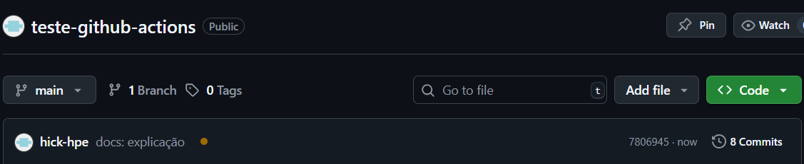
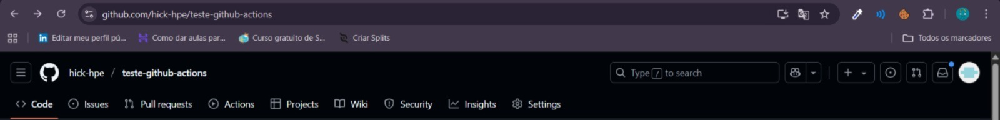
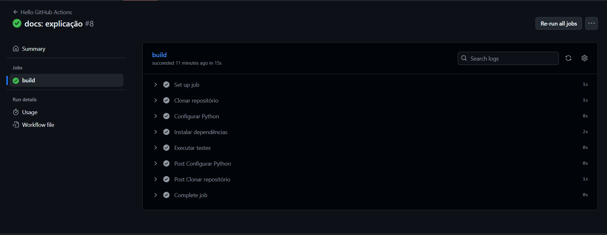

# GitHub Actions

O GitHub Actions é uma plataforma de integração contínua e entrega contínua (CI/CD) que permite automatizar a sua compilação, testar e pipeline de implantação. É possível criar fluxos de trabalho que criam e testam cada pull request no seu repositório, ou implantar pull requests mesclados em produção em máquinas virtuais do Linux, Windows e MacOS.

## Componentes do GitHub Actions

- `workflows`: processo automatizado configurável que executará um ou mais trabalhos. Inicia sua execução após um evento ser disparado (ex: push). Toda sua configuração é definida em um arquivo YAML.

- `events`: atividade específica em um repositório que dispara a execução de um fluxo de trabalho. Exemplos:
    - push
    - pull_request
    - workflow_dispatch
    - schedule
    - release
    - issues

- `jobs`: conjunto de etapas em um fluxo de trabalho executadas no mesmo executor.

- `runner`: servidor que executa seus fluxos de trabalho. Disponíveis no GitHub:
    - Linux
    - Windows
    - MacOS

## Criar o seu primeiro fluxo de trabalho

Este workflow exibirá 'Hello, World', através de um terminal Linux
- Criar a pasta `.github/workflows`
- Criar o arquivo `hello-world.yml` dentro da pasta `.github/workflows`
- Dentro do arquivo:
    ```yaml
    # define o nome do workflow
    name: Hello World
    
    # define os listeners
    on:
      # ouvindo o evento de `push`
      push:
        # as branches que executaram o workflow
        branches:
          - main
    
    # definição dos jobs
    jobs:
      # job `hello`
      hello:
        # servidor que irá executar
        runs-on: ubuntu-latest
        # etapas
        steps:
          # nome da etapa
          # - name: Clonar repositório
          #   # clonar o repositório com variáveis de ambiente configuradas
          #   uses: actions/checkout@v4
          
          # - name: Configurar a versão do Python
          #   uses: actions/setup-python@v4
          #   with:
          #     python-version: '3.11.9'
    
          # nome da etapa
          - name: Dizer "Hello"
            # comando a executar
            run: echo "Hello, World!"
    ```
## Visuaizando execução

- Realizar o commit
- Enviar para o repositório
- Acessar o repositório no navegador
- Acima das pastas, notará um símbolo amarelo:
    
    Isso indica que o workflow está executando.

- Acessar a aba `Actions`, podemos ver todos os workflows criados
    

- Workflows
    

    Podemos ver os detalhes de cada etapa.

## Code + Testes
Servindo como base para a atividade, segue o exemplo das etapas de `code` e `tests` em Python, com a biblioteca `pytest`.
- Criar ambiente virtual.
    ```bash
    virtualenv venv
    ```
- Ativar ambiente virtual.
    ```bash
    source venv/bin/activate
    ```
- Instalar a biblioteca `pytest`.
    ```bash
    pip install pytest
    ```
- Criar o arquivo `exemplo.py`.
    ```python
    def funcao_carregar_aquivo():
        return "Arquivo carregado!!!"

    def funcao_ler_aquivo():
        return "Leitura realizada!!!"
    ```
- Criar o arquivo `test_exemplo.py`.
    ```python
    from exemplo import funcao_carregar_aquivo, funcao_ler_aquivo

    def test_carregar_aquivo():
        assert funcao_carregar_aquivo() == "Arquivo carregado!!!"
        
    def test_ler_aquivo():
        assert funcao_ler_aquivo() == "Leitura realizada!!!"
    ```
- Executar os testes:
    ```bash
    pytest
    ```
- Saída bem sucedida:
    ```bash
    ===================================================================== test session starts =====================================================================
    platform win32 -- Python 3.11.9, pytest-8.4.1, pluggy-1.6.0
    rootdir: C:\Users\hpale\Desktop\teste-github-actions
    collected 1 item                                                                                                                                               

    test_exemplo.py ..                                                                                                                                    [100%] 

    ====================================================================== 2 passed in 0.03s ======================================================================
    ```
- Para ver o status de cada teste:
    ```bash
    pytest -v
    ```
- Saída com o nome de teste que está sendo executado:
    ```bash
    ===================================================================== test session starts =====================================================================
    platform win32 -- Python 3.11.9, pytest-8.4.1, pluggy-1.6.0 -- C:\Users\hpale\Desktop\teste-github-actions\venv\Scripts\python.exe
    cachedir: .pytest_cache
    rootdir: C:\Users\hpale\Desktop\teste-github-actions
    collected 2 items                                                                                                                                              

    test_exemplo.py::test_carregar_aquivo PASSED                                                                                                                  [ 50%]
    test_exemplo.py::test_ler_aquivo PASSED                                                                                                                  [100%]

    ====================================================================== 2 passed in 0.05s ======================================================================
    ```
- Alterando `exemplo.py` para gerar um erro:
    ```python
    def funcao_carregar_aquivo():
        return "Arquivo não carregado!!!"
    
    ```
- Saída mal sucedida:
    ```bash
    ===================================================================== test session starts =====================================================================
    platform win32 -- Python 3.11.9, pytest-8.4.1, pluggy-1.6.0 -- C:\Users\hpale\Desktop\teste-github-actions\venv\Scripts\python.exe
    cachedir: .pytest_cache
    rootdir: C:\Users\hpale\Desktop\teste-github-actions
    collected 2 items                                                                                                                                              

    test_exemplo.py::test_carregar_aquivo FAILED                                                                                                             [ 50%]
    test_exemplo.py::test_ler_aquivo PASSED                                                                                                                  [100%]

    ========================================================================== FAILURES ===========================================================================
    ____________________________________________________________________ test_carregar_aquivo _____________________________________________________________________

        def test_carregar_aquivo():
    >       assert funcao_carregar_aquivo() == "Arquivo carregado!!!"
    E       AssertionError: assert 'Arquivo não carregado!!!' == 'Arquivo carregado!!!'
    E
    E         - Arquivo carregado!!!
    E         + Arquivo não carregado!!!
    E         ?        ++++

    test_exemplo.py:4: AssertionError
    =================================================================== short test summary info =================================================================== 
    FAILED test_exemplo.py::test_carregar_aquivo - AssertionError: assert 'Arquivo não carregado!!!' == 'Arquivo carregado!!!'
    ================================================================= 1 failed, 1 passed in 0.41s =================================================================
    ```

## Atividade

Acessar: [https://github.com/hick-hpe/workshop-github-actions/tree/atividade](https://github.com/hick-hpe/workshop-github-actions/tree/atividade)
